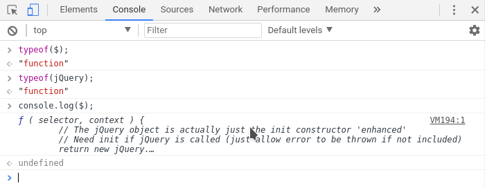
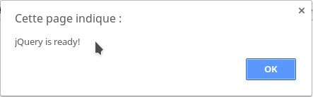

<!-- footer: Copyright 2017 © Glenn ROLLAND – Reproduction interdite -->
<!-- page_number : true -->

<link rel="stylesheet" href="../../assets/style.css" />

# Contextualiser l'utilisation de jQuery et retracer l'historique

### Vérifier la présence de jQuery

<!-- 01/04 TD -->

----

## Vérifier la présence de jQuery

Vous avez suivi pas à pas la démarche pour installer jQuery sur votre page web en cours de création. Excellent ! 

Mais un bug est si vite arrivé... Comment __vérifier vous-même que jQuery est bien installé et prêt à l'emploi__ avant de commencer à développer ?

----

## Vérifier la présence de jQuery avec la console JS

1. Ouvrir la console Javascript de votre navigateur web.
2. Taper `typeof($);`ou `typeof(jQuery);` dans la console.

__La réponse du navigateur doit être `"function"`__, comme illustré ci-dessous :



----

## Vérifier la présence de jQuery avec du code

```html5
<html>
  <head>
    <script type="text/javascript"  
    src="bower_components/jquery/dist/jquery.min.js">  
    <!-- ... -->
  </head>
  <body>
    <!-- ... -->
    
    <!-- insérez dans votre page le code suivant -->
    <script>
      $(document).ready(function () { 
        alert("jQuery is ready!"); 
      });
    </script>
    <!-- jusqu'ici. STOP -->
    
  </body>
</html>
```

----


## Vérifier la présence de jQuery avec du code (suite)

Lorsque vous chargez votre page HTML dans le navigateur, la _pop-up_ suivante doit apparaître :



----

## Merci pour votre attention 

C'est bon, maintenant vous êtes prêts à démarrer vos projets avec jQuery !
