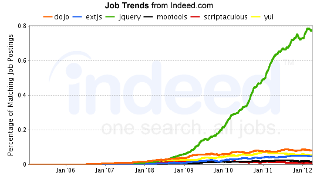

## À propos de Javascript

### Coté client

Navigateurs web  
(Firefox, Chrome, etc.)

### Coté serveur

[Node.JS](http://nodejs.org/) - serveur _event-driven_

[PhantomJS](http://phantomjs.org/) - navigateur _headless_

## Bonnes pratiques

### Les logs

`console.log()` c'est bien

`alert()` c'est mal

`document.write()` c'est TRÈS mal !

### Quelques outils

  * DOM Inspector (Firefox)
  * FireBug (Firefox)
  * Developper Tool (Firefox)
  * Inspector (Chrome)

### Coté asynchrone

## Optimiser son code

### Javascript non intrusif

Eviter les scripts autres que ceux de chargement

### Accélerer le chargement

Chargement les bibliotheques en fin de page

## Manipuler le HTML

### DOM

### Manipuler un élément

`document.getElementById( name )`

### Naviguer dans le document

`Node.childNodes`  
=> Array

`Node.childNodes.length`  
pratique pour vérifier le contenu

### Editer les elements

`Node.innerText`

`Node.textContent`

### Vérifier la présence d'un noeud

### Créer des noeuds

### Insérer des noeuds

`Node.insertBefore()`

`Node.insertAfter()`

### Cloner

### Remplacer

### Supprimer

### Notions sur les références

## Cadre applicatif

### Définition

_(= Framework)_

  * Ensemble cohérent de fonctions
  * Faciliter le travail
  * Evite de réinventer la roue

### Pourquoi en utiliser ?

Permet de trouver du travail !

### Pourquoi ne pas en utiliser ?

  * Comprendre ce qui se passe
  * Répondre à un _objectif précis_
  * Passer moins de temps à _adapter le fonctionnement_
  * Ne pas charger une bibliothèque _pour une seule fonction utile !_

### Quelques possibilités

  * Dojo Toolkit
  * Prototype
  * Mootools
  * Script.aculo.us
  * Ext.JS
  * **JQuery**

### JQuery

  * GPL/MIT
  * La plus populaire !
  * Autant utilitaire que graphique
  * Avec de nombreux plugins !

## Fin

### Références

  * [Console.Log : Say Goodbye to JavaScript Alerts for Debugging!](http://blogs.msdn.com/b/cdndevs/archive/2011/05/26/console-log-say-goodbye-to-javascript-alerts-for-debugging.aspx)
  * [JavaScript Framework Matrix](http://matthiasschuetz.com/javascript-framework-matrix/en/)
  * [Dojo Toolkit](FIXME)
  * [Script.aculo.us](FIXME)
  * [Mootools](FIXME)
  * [Prototype](FIXME)
  * [ ExtJS ](http://www.sencha.com/products/extjs/)

### Des questions ?

