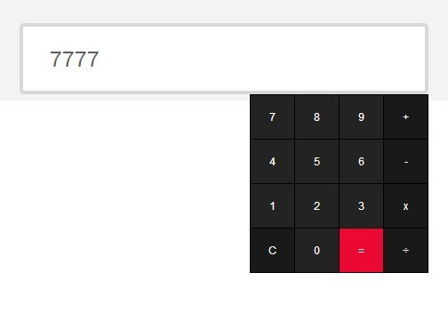

<!-- footer: Copyright 2017 © Glenn ROLLAND – Reproduction interdite -->
<!-- page_number : true -->

<link rel="stylesheet" href="../../assets/style.css" />

# Se documenter, installer et configurer correctement un plugin jQuery

### Définition d'un plugin jQuery

<!-- 03/01 Document -->

----

## Définition d'un plugin jQuery

__jQuery facilite le développement javascript, mais ne fournit pas de fonctionnalité directement visible à l'utilisateur__. Cependant elle a permis l'apparition de toute un écosystème de _plug-ins_ (_extensions_ en français).

Ces plugins, peuvent être très simple et n'ajouter qu'une fonction à jQuery... ou aller jusqu'à  fournir des morceaux entiers d'interfaces et des fonctionallités prêtes à l'emploi.

__Dans ce cours, nous allons voir quelques exemples de plugins__ avant de plonger plus en détails dans leur fonctionnement.

----

## Quelques exemples de plugins

Les plugins jQuery vous permettront d'ajouter simplement à votre page : 

* des pop-up , 
* des galeries de photos, 
* des barres de navigation animées, 
* des calculatrices, 
* des calendriers, 
* des arrière-plans vidéo
* de la mise en page automatique
* ... et bien plus encore.

----

## Exemple n°1 : jCalculator

jCalculator __ajoute une calculatrice à un champ de saisie de texte__  `<input type="text"/>` de votre choix.

Cliquez dans le champ et une calculatrice de base apparaît. Vous pouvez ajouter des nombres ensemble, multiplier, soustraire, et diviser et les résultats apparaissent dans le champ de formulaire.

* [Code source](https://github.com/balajmarius/jcalculator)
* [Démo](https://www.jqueryscript.net/demo/jQuery-Plugin-To-Create-A-Simple-Calculator-For-Text-Field-jCalculator/)

----

## Exemple n°2 : Thumbnail grid

Thumbnail grid met en page votre gallerie. Il __redimensionne toutes les photos à la taille souhaitée et affiche des informations__ lorsque l’on clique sur l'une des images.

 

* [Code source]()
* [Démo](https://tympanus.net/Tutorials/ThumbnailGridExpandingPreview/)

----

## Exemple n°3 : Animsition

Animsition permet de faire __des transitions, animées en CSS,  entre les pages__ HTML.

Vous paramétrez votre effet et il l'ajoute automatiquement sur tous les liens `<a href="...">` qui seront cliqués par l'utilisateur.

* [Code source](https://github.com/blivesta/animsition)
* [Démo](http://git.blivesta.com/animsition/)

----

## Exemple n°4 : Face detection

Un plugin jQuery / Zepto pour __détecter les visages__ sur les images, les vidéos. 

Il permet d'obetnir __d'obtenir leurs coordonnées et d'en extraire les images__. 

* [Code source](https://github.com/jaysalvat/jquery.facedetection)
* [Démo](http://facedetection.jaysalvat.com/)

----

## Si vous voulez approfondir ce chapitre

Ces quelques articles peuvent vous intéresser :

* [Learn jQuery : Plugins](https://learn.jquery.com/plugins/)
* [Tutorials Point : jQuery plugins](https://www.tutorialspoint.com/jquery/jquery-plugins.htm)
* [Speckyboy : The 50 Most Useful jQuery Plugins for Frontend Development](https://speckyboy.com/free-jquery-plugins/)

----

## Merci pour votre attention
