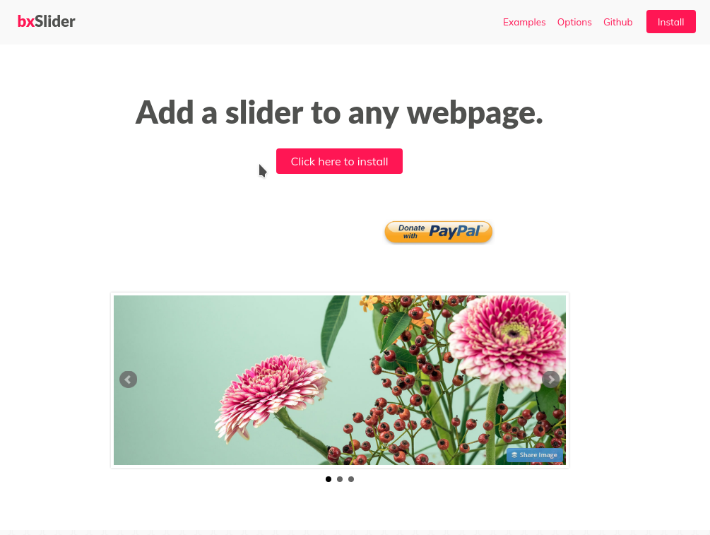
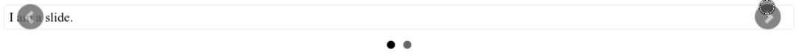

<!-- footer: Copyright 2017 © Glenn ROLLAND – Reproduction interdite -->
<!-- page_number : true -->

<link rel="stylesheet" href="../../assets/style.css" />

# Se documenter, installer et configurer correctement un plugin jQuery

### Installer un slider animé avec _bxSlider_

<!-- 03/03 Document -->

----

### Installer un slider animé avec _bxSlider_

Voyons ensemble comment utiliser un plugin jQuery.

Ici nous allons __réaliser un _slider_, c'est à dire un bandeau d'images défilantes... mais sans coder ni le JavaScript, ni le CSS nous-mêmes.__ Nous allons utiliser le plugin jQuery _bxSlider_ qui va faire le travail à notre place.

De plus, vous allez voir qu'utiliser un plugin est la plupart du temps un jeu d'enfant. 

----

## Les étapes

L'utilisation d'un plugin jQuery suit généralement les étapes suivantes :

1. Créez votre page HTML, sans le plugin en question
2. Téléchargez le plugin
3. Chargez la bibliothèque en CSS / JS
4. Créez les balises HTML nécessaires à son fonctionnement
5. Initialisez votre plugin
6. Hop ! Ça fonctionne :wink:

----

## Une page HTML

Tout d'abord, créez une page web minimale qui inclue jQuery.

<gx-label>HTML</gx-label>

```
<!doctype html>
<html>
  <head>
     <meta charset="utf-8" />
     <title>Démo bxSlider</title>
     <script src="js/jquery.min.js"></script>
  </head>
  <body>
    <h1>Démo bxSlider</h1>
  </body>
</html>
```

----

## Télécharger bxSlider



Ensuite, allons sur le site officiel du plugin : <https://bxslider.com> . Une fois sur ce site, cliquez sur _click here to install_.

Vous avez là quatre options, au choix : 

* _the easy way_ : c'est à dire __utiliser un réseau de distribution de contenu__ (_content delivery network_ ou _CDN_, en anglais)
* _the other ways_ n°1 : __téléchager l'archive zip__
* _the other ways_ n°2 : __utiliser bower__, un gestionnaire de paquets logiciels pour le javascript front-end
* _the other ways_ n°3 : __utiliser npm__, un gestionnaire de paquets logiciels pour le node.js

----

## Téléchargez l'archive zip

Sur la page en question, __cliquez sur "Download jquery.bxslider.zip" here__.

Décompressez l'archive et __copiez la version minimisée des fichiers JavaScript et CSS dans le les dossier respectifs dans lequel vous faites vos développements__ pour ces deux langages : probablement les dossiers `js/` et `css/` . 

Vous êtes maintenant prêts à utiliser le plugin !

----

## Charger le script dans votre page 

Suivons ce qu'indique la documentation et __ajoutons les balises `<link>` et `<script>` dans l'en-tête HTML__ de votre page :

<gx-label>HTML</gx-label>

```
<!DOCTYPE html>
<html>
  <head>
    <meta charset="utf-8" />
    <title>Démo bxSlider</title>
 
    <!-- le chargement JS / CSS du slider -->
    <link rel="stylesheet" 
          href="css/jquery.bxslider.css">
    <script src="js/jquery.min.js"></script>
    <script src="js/jquery.bxslider.min.js"></script>
    
  </head>
  <!-- ... la suite de la page ... -->
```

----

## Intégrer du contenu dans le slider 

Continuons à lire la documentation, __ajoutons quelques balises HTML pour le contenu du slider__ dans le `<body>`

<gx-label>HTML</gx-label>

```
  <!-- ... le haut de la page ... -->    
  <body>
    <h1>Démo bxSlider</h1>
    
     <!-- le contenu HTML du slider -->
    <div class="slider">
      <div>Je suis une slide</div>
      <div>Je suis une autre slide.</div>
    </div>
    
  </body>
</html>
```

----

##  Initialisez votre slider en javascript

Toujours d'après la documentation de _bxSlider_, ajoutons une nouvelle balise `<script>` __dans l'en-tête du document HTML__, avant la fin du `<head>` :

<gx-label>HTML</gx-label>

```
  <!-- ... le haut de la page ... -->    

    <!-- Initialisation du slider
         pour tout class="slider"-->
    <script>
    $(document).ready(function(){
      $('.slider').bxSlider();
    });
    </script>
    
  </head>
  <!-- ... la suite de la page ... -->
```

----

## Voila, c'est prêt :)

Le slider fonctionne, mais il est minimaliste :



C'est maintenant à vous d'ajouter le style CSS pour enjoliver le rendu : taille du slider, position des chevrons latéraux, etc.

<small>:arrow_right: Vous trouverez  le code complet de cet exemple dans l'archive `03_code_source.zip`</small>

----

## Merci pour votre attention
