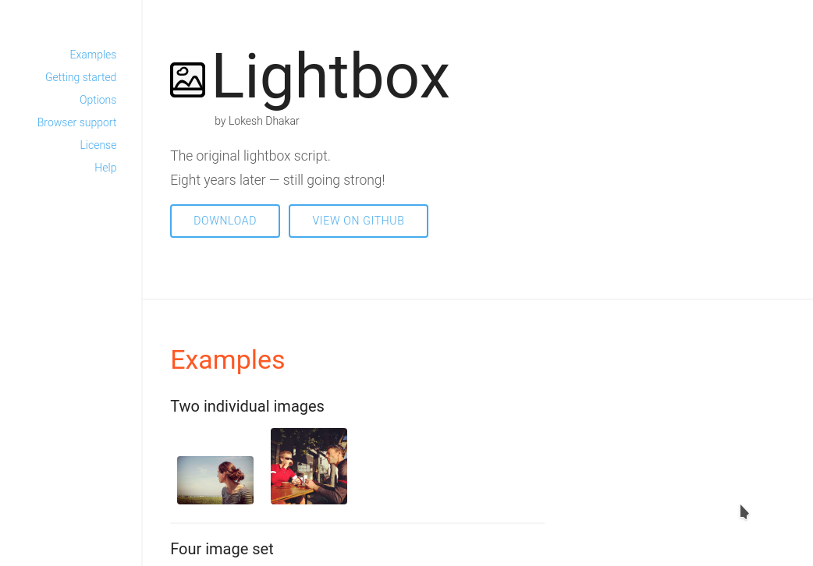
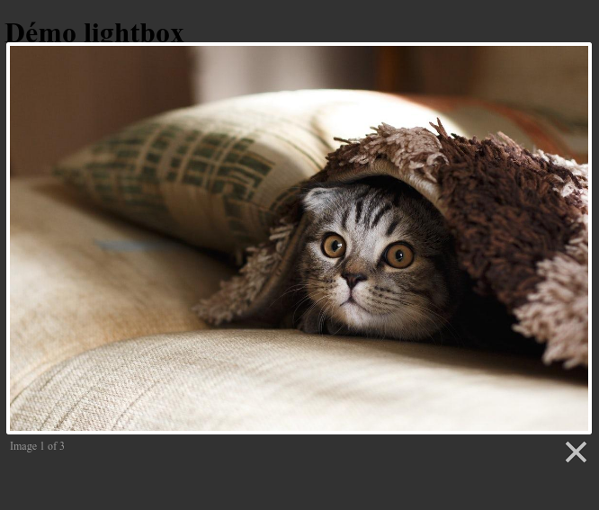

<!-- footer: Copyright 2017 © Glenn ROLLAND – Reproduction interdite -->
<!-- page_number : true -->

<link rel="stylesheet" href="../../assets/style.css" />

# Se documenter, installer et configurer correctement un plugin jQuery

### Installer une galerie d'images avec "lightbox"

<!-- 03/04 Document -->

----

## Installer une galerie d'images avec "lightbox"

Voyons ensemble comment utiliser un autre plugin jQuery.

Cette fois ci, nous allons réaliser une __galerie, c'est à dire une collection d'images__ sur laquelles nous pourrons cliquer... et obtenir une image agrandie avec des informations supplémentaires.

Là encore, __nous n'allons coder ni le JavaScript, ni le CSS nous-mêmes.__ Nous allons utiliser le plugin jQuery _lightbox_ qui va faire le travail à notre place.

Une fois de plus, vous aller trouver cela très facile :wink:

----

## Les étapes

Les étapes de l'utilisation du plugin jQuery _lightbox_ sont les mêmes que d'habitude :

1. Créez votre page HTML, sans le plugin en question
2. Téléchargez le plugin
3. Chargez la bibliothèque en CSS / JS
4. Créez les balises HTML nécessaires à son fonctionnement
5. Initialisez votre plugin
6. Hop ! Ça fonctionne :wink:

----

## Une page HTML

Tout d'abord, créez une page web minimale qui inclue jQuery.

<gx-label>HTML</gx-label>

```
<!doctype html>
<html>
  <head>
     <meta charset="utf-8" />
     <title>Démo lightbox</title>
     <script src="js/jquery.min.js"></script>
  </head>
  <body>
    <h1>Démo lightbox</h1>
  </body>
</html>
```

----

## Télécharger _lightbox_



Ensuite, allons sur le site officiel du plugin : <http://lokeshdhakar.com/projects/lightbox2/> . 

Une fois sur ce site, cliquez sur _Download_.

Cette fois nous allons __télécharger l'archive zip__.

----

## Téléchargez l'archive zip

Décompressez l'archive et __copiez la version minimisée__ des fichiers JavaScript et CSS dans le le dossier dans lequel vous faites vos développements. Ici, cela revient à __copier le contenu du dossier `dist/` dans votre projet__.

Vous êtes maintenant prêts à utiliser le plugin !

Allons maintenant voir la documentation de lightbox, à la section _Getting started_ ...

----

## Charger le script dans votre page 

Suivons ce qui est indiqué dans la documentation pour inclure le CSS et le Javacript, et __ajoutons les balises `<link>` et `<script>` dans l'en-tête HTML__ de votre page :

<gx-label>HTML</gx-label>

```
<!DOCTYPE html>
<html>
  <head>
    <meta charset="utf-8" />
    <title>Démo lightbox</title>
    <script src="js/jquery.min.js"></script>
 
    <!-- le chargement JS / CSS du slider -->
    <link href="css/lightbox.css" rel="stylesheet">
    <script src="js/lightbox.js"></script>
    
  </head>
  <!-- ... la suite de la page ... -->
```

----

## Intégrer du contenu dans la galerie

Tout d'abord, ajoutons quelques images dans le dossier `images/` de votre site : 

* `images/image-1.jpg`
* `images/image-2.jpg`
* `images/image-3.jpg`

----

## Intégrer du contenu dans la galerie (suite)

D'après la documentation, le plugin reconnait les galerie d'après l'attribut `data-lightbox`sur des balises `<a href=...>`

__Ajoutons donc quelques balises `<a>` pour créer une galerie__,  dans le `<body>`

<gx-label>HTML</gx-label>

```html
    <!-- ... le haut de la page ... -->    
    <h1>Démo lightbox</h1>
    
     <!-- le contenu HTML de la galerie -->
     <a href="images/image-1.jpg" 
        data-lightbox="roadtrip">Image #1</a>
     <a href="images/image-2.jpg" 
        data-lightbox="roadtrip">Image #2</a>
     <a href="images/image-3.jpg" 
        data-lightbox="roadtrip">Image #3</a>
  </body>
</html>
```

----

##  Initialisez votre slider en javascript

Pas besoin de l'initialiser, __par défaut ce plugin il s'initialise tout seul__ au lancement de la page ! 

Vous pouvez cependant le paramétrer avec des options sur-mesure avec une balise `script>` et les paramètres qui vous conviennent le mieux (tirés de la section _Options_ du site officiel du plugin) :

<gx-label>HTML</gx-label>

```html
<script>
    lightbox.option({
      'resizeDuration': 200,
      'wrapAround': true
    })
</script>
```

----

## Voila, c'est prêt :)

La galerie fonctionne, mais elle est minimaliste : il y a seulement du texte...



C'est maintenant à vous d'enjoliver le rendu : insérer des images dans les liens, paramétrer le slider à vos goûts (ou ceux du client), etc.

<small >:arrow_right: Vous trouverez  le code complet de cet exemple dans l'archive `03_code_source.zip`</small>

----

## Merci pour votre attention
