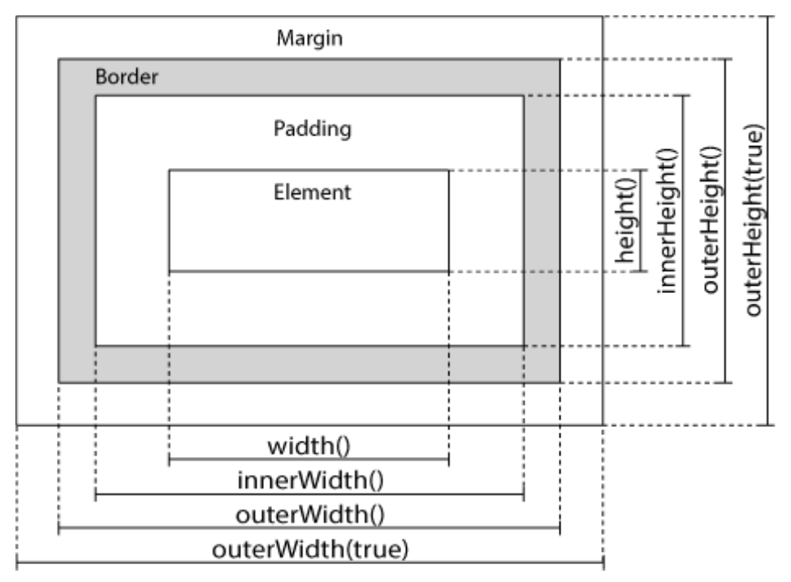

<!-- footer: Copyright 2017 © Glenn ROLLAND – Reproduction interdite -->
<!-- page_number : true -->

<link rel="stylesheet" href="../../assets/style.css" />

# Manipuler le DOM avec jQuery

### Récupérer et définir les dimensions d’éléments HTML

<!-- 04/05 Document -->

----

## Dimensionnement d'éléments avec jQuery

L'un des avantages de jQuery est sa capacité à rendre interactif les aspects visuels de la page et en cela qu'il permet de modifier un certain nombre de propriétés CSS.

Parmi celles-ci, on note un ensemble de fonction qui permettent de mesurer et de modifier la taille des éléments HTML de la page :

* `.width()` / `$.height()`
* `.innerWidth()` / `$.innerHeight()`
* `.outerWidth()` / `$.outerHeight()`

----

## Dimensionnement d'éléments avec jQuery

### Hauteur et largeur

Les fonctions `.height()` et `$.width()` permettent, respectivement, de lire et de modifier la hauteur et la largeur __du contenu des éléments HTML__ , c'est à dire sans _border_ et sans _padding_.

Elles fonctionnent de la même façon que `.html()` et `$.text()` : 

* en lecture, sans paramètre
  
   <gx-label>Javascript</gx-label>
   ```
   $('#login').width();
   ```
* en modification, en passant en paramètre la nouvelle valeur
   
   <gx-label>Javascript</gx-label>
   ```
   $('#login').width(250);
   ```

----

## Dimensionnement d'éléments avec jQuery

### Dimension interne

Les fonctions `.innerHeight()` et `$.innerWidth()` permettent, respectivement, de lire et de modifier la hauteur et la largeur des éléments HTML __contenu et _padding_ inclus__, mais _border_ exclu.

Elles fonctionnent de la même façon que `.width()` et `$.height()`.

----

## Dimensionnement d'éléments avec jQuery

### Dimension externe

Les fonctions`.outerHeight()`, `$.outerWidth()` permettent, respectivement, de lire et modifier la hauteur et la largeur des éléments HTML, __avec leur _padding_ et leur _bordure___.

Elles fonctionnent de la même façon que `.width()` et `$.height()` également.

<small>

:arrow_right: un booléen peut être est passé à la méthode pour préciser s'il faut inclure le margin ou non : `false` indique que _margin_ n'est pas inclus (valeur par défaut).

</small>

----

## En bref




<small>

:arrow_right: Voir <https://jsfiddle.net/glenux/7wzy1yyy/7/> pour un exemple interactif

</small>

----

## Merci pour votre attention
